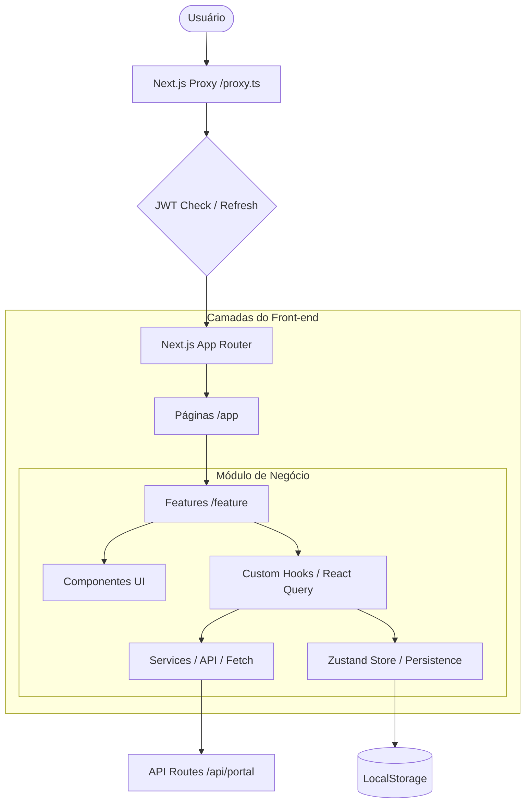

# Case Técnico: Portal de Ofertas e Contratação (PJ)

Este projeto implementa um módulo web voltado para o aumento de conversão (_growth_) de clientes PJ através de ofertas personalizadas. A solução foca em resiliência de dados, segurança server-side e arquitetura escalável.

## 🏗 Desenho da Solução (Arquitetura)

### Decisões de Arquitetura

- **React 19 + Next.js 16 (App Router)**: Escolha baseada em performance (Server Components) e na robustez do novo padrão de Proxy para segurança.
- **Hooks Modernos (React 19)**: Uso de `useTransition` para filtragem não bloqueante, `useOptimistic` para feedback imediato em contratações.
- **Next.js 16 Proxy Pattern**: Autenticação transparente via servidor. O `proxy.ts` gerencia o ciclo de vida do JWT (refresh automático) sem expor lógica de renovação ao cliente.
- **Zustand + Persistência**: Gerenciamento de rascunhos de simulação via _Factory Pattern_, com isolamento por oferta e usuário.
- **Performance & Code-Splitting**: Implementação de `next/dynamic` para carregamento sob demanda de fluxos complexos (SimulationFlow), reduzindo o bundle inicial.
- **TanStack Query v5**: Gestão eficiente de _Server State_, cache e sincronização.

## 📂 Estrutura do Projeto

A organização segue o padrão de **Feature-Based Architecture**, isolando domínios de negócio para facilitar a manutenção e testes:

- `src/app`: Camada de roteamento, layouts e Server Components (Next.js).
- `src/feature`: Módulos de negócio (ex: `Offers`, `Auth`). Cada feature contém seus próprios componentes, hooks, services e stores.
- `src/components`:
  - `ui/`: Componentes base (Shadcn UI).
  - `shared/`: Componentes genéricos reutilizáveis (Loading, Empty states).
  - `portal/`: Componentes de layout do dashboard.
- `src/lib`: Utilitários globais (Analytics, Feature Flags, API Client).
- `src/test`: Setup global de testes, mocks e factories de dados.

## 🎨 Design System & Governança

O projeto utiliza uma abordagem de **Design System Adaptável** para garantir consistência e agilidade:

- **Shadcn UI + Tailwind CSS 4**: Componentes de alta qualidade com controle total sobre o código fonte.
- **Design Tokens**: Centralizados via variáveis CSS no `globals.css`, permitindo alteração de marca e suporte nativo a Dark Mode.
- **Componentização**:
  - **UI Atoms**: Componentes puros em `src/components/ui`.
  - **Business Molecules**: Componentes com lógica de negócio dentro de `src/feature/*/components`.
- **Checklist de Acessibilidade**: Garantia de navegação por teclado, contraste e suporte a leitores de tela integrado ao desenvolvimento.

## 🛠 Funcionalidades Entregues

1.  **Lista de Ofertas**: Grid de cards com filtros por categoria e tratamento de estados (Loading, Empty, Error).
2.  **Detalhe da Oferta**: Visão aprofundada com justificativa personalizada ("Por que esta oferta é para você").
3.  **Fluxo de Simulação (3 Etapas)**:
    - **Dados**: Seleção de valores e prazos.
    - **Revisão**: Verificação de taxas e parcelas.
    - **Confirmação**: Aceite de termos e geração de protocolo.
4.  **Resiliência (Retomada)**: Se o usuário sair no meio da simulação, o estado é recuperado automaticamente ao retornar para a mesma oferta e modifica componente pai.

## 🔐 Estratégias de Qualidade

- **Acessibilidade (a11y)**: Conformidade com WCAG 2.1 através de `aria-labels`, estados semânticos (`aria-pressed`, `aria-current`) e ícones decorativos ocultos (`aria-hidden`).
- **Analytics de Funil**: Rastreamento centralizado (`analytics.ts`) de eventos críticos: visualização de oferta, aplicação de filtros e conclusão de contratação.
- **Refresh Token Transparente**: Implementado no `proxy.ts` garantindo que a sessão seja renovada sem interrupções de UX.
- **Feature Flags**: Lógica de segmentação (VAREJO, PRIVATE, CORPORATE) integrada diretamente na visibilidade de CTAs e acesso a rotas.
- **Suíte de Testes (Vitest + RTL)**: Cobertura de componentes críticos (LoginForm, OfferList, OfferCard), lógica de negócio (Feature Flags, Analytics) e persistência (Simulation Store).

## 🔧 Como Executar

1.  `npm install`
2.  Configurar `.env.local`: `JWT_SECRET=sua_chave`
3.  `npm run dev`
4.  `npm test` (Executar suíte de testes)
5.  `npm run test:coverage` (Verificar cobertura)

---

_Este projeto demonstra competências técnicas em arquitetura front-end moderna._
